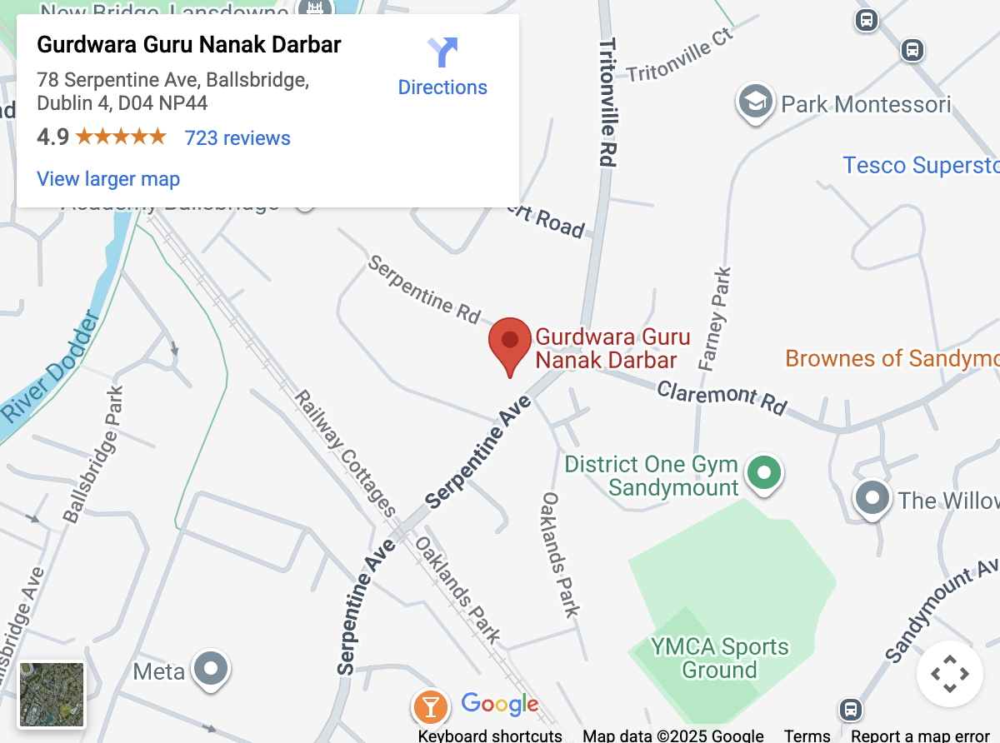

# About me
I am Abhinaw. I came to Dublin a few years ago. This guide is my effort to help others, especially Indians, with firsthand information and insights about this place.

If you like this guide, you can buy me a coffee at
Revolut: https://revolut.me/abhinaw

You can connect with me on LinkedIn at https://www.linkedin.com/in/abhinawtiwari/. Please don't hesitate to DM for paid appointments.

I have also created a video series on YouTube, available at https://www.youtube.com/playlist?list=PLH_4qIEY5Eyh5H4C1fUG6R45jcOTjfRLD
# Good Universities for Master's
Trinity College Dublin (TCD) and University College Dublin (UCD) are the best ones.   There are others such as 
- National College of Ireland (NCI), 
- TU Dublin, 
- Dublin Business School
- Griffith College, etc

# Jobs
Most Indians in Dublin work in Tech and nursing. I would be surprised if you visit a tech office and not see an Indian. Similarly, a substantial Indian population of Kerala origin work in nursing.
# Pay
Refer https://www.levels.fyi/t/software-engineer/locations/greater-dublin-area for reliable pay related information for tech jobs.
# Send money home
There are many ways to send money home but I have been using Aspora for a while. Aspora has been the best so far. It lets you send money on google rates, which is unprecedented. It's no advertisement by the way, just my personal experience. Your first transfer is free, and you earn €25 when you send €1000+ total.

Use my code: 0FB1E77E or sign up using my link here: https://link.aspora.com/DYot/0FB1E77E.
# Places to live
South of Dublin is usually considered the nicest and safest to live. 

Portobello, Rathmines, Ranelagh, Irishtown, Ballsbridge are personal favorites.

# Rentals
https://www.daft.ie/ for house hunting.

# Groceries
For regular groceries, following are the go to places -
Lidl, Aldi, Tesco, Spar, Centra etc.
# Tech companies
Google, Amazon, Microsoft, Stripe, Meta  
Mastercard, AIB, PTSB, Citibank  
IBM  
Pinterest, Sony Playstation, Workday, ServiceNow, Salesforce, JP Morgan

There are many more. I just listed a few I have come across closely.
# Visa 
## Visa progression
Master's route: Stamp 2 -> Stamp 1G -> Stamp 1 -> Stamp 4
## IRP renewal
https://inisonline.jahs.ie/home
# Part-time
I worked part-time for just 2 weeks at a Cirlce K's Deli. I quickly realized it wasn't for me. I pivoted to teaching part-time during my master's.

But others work part-time at all sorts of places - Circle K, Spar, Lidl, Tesco, Penneys, food delivery, Amazon delivery, Security etc.
# Commute
Leap card is advisable as soon as you land here. As a student, you get 50% discount on all your commutes using leap card. 

More on leap card [here](https://about.leapcard.ie/).

Common modes of commute are Dublin Bus, Luas, Dart, Commuter, Rail  

There are long journey trains from Heuston station in Dublin, taking you to other cities like Galway.

Checkout Dublin Public transport at https://www.dublinpublictransport.ie/  
Transport for Ireland network maps at https://www.transportforireland.ie/plan-a-journey/network-maps/

You can have a look at the Dublin rail map — DART, Luas and key airport bus routes at https://www.dublinpublictransport.ie/dublin-train-map

Cabs are very costly here but you can use the following on emergency or if you have an extra kidney to spare - Dublin Taxi, Uber, Bolt, Freenow.

## Importance of street names
In India, we aren't used to street names so much. We have street names there, but I feel it's not part of our daily conversation the way it works in Dublin. In Dublin, people rely a lot on street names. Whenever they have to talk about a place, they refer to it by its street name. It takes a bit of time, but it's worth starting to refer to places by street names. For example, X restaurant is on Y street, and so on.

# Travel
As an Indian citizen on Irish residence permit card, you don't automatically get access to other EU countries or Schengen area. This is a huge disadvantage I feel. You are pretty much landlocked in this country on IRP card. To enter other countries, you need to go through a separate visa process.

- e-visa: as an Indian, you can get an e-visa to countries like Morocco.
- Visa: Schengen, US, UK visas need to be applied separately. 

Embassy area: embassies of other countries are very conveniently located around Dublin 2 and 4.
  
# Safety
## Personal safety
Places to avoid or be careful at - Tallaght, Citywest.  
Bike theft: bike theft is unfortunate but common here. So, better to be safe than sorry.  
Teenage laws: criminal laws for under 18 Irish citizens are usually loose. This is not a legal advice but I would stay away from them. 

## Road safety
Ireland has similar road safety rules like India. It's also easier because Ireland also follows the stay on left side rule.

There are bike lanes if you cycle. There are safety standards for bikes too, like lights, high-visibility vests, helmet etc.
# Driving license
If you are habituated to drive two-wheelers in India, Ireland's weather may not be the most suitable for it.

International permit issued from India can help you drive a car here for a year. Beyond that, you need an Irish driving license.
# Geography
Ireland has four seasons: winter, spring, summer, and autumn. For meteorological purposes, they are defined as follows: winter (December to February), spring (March to May), summer (June to August), and autumn (September to November). 

# Health and fitness
Gym, Swimming, jogging, home exercises  
Swim centeres: Swan Leisure. More later.
# Medical system
Medicines
- Pharmacy
- Other stores like Lidl sell paracetamols, vitamins and other nutrional supplements.

Finding a General Practioner (GP) https://www2.hse.ie/services/find-a-gp/  

Getting Flu vaccine: https://www2.hse.ie/services/find-a-vaccine/?kind=adult-flu-vaccine

Hospitals: Many hospitals are there such as James hospital, Crumlin hospital etc.  

Insurance: Laya, VHI are a few of the popular providers. 

Hospital delays: It's common to face delays in treatment at the hospitals here. More on this later.

# Cultural differences
- Food differences
- lifestyle differences

# Indian Embassy
## Address and contact: 
Address: 69 Merrion Rd, Ballsbridge, Dublin-4, Co. Dublin, D04 ER85
Emergency contact: 0899423734, cons.dublin@mea.gov.in

## Events
- Independence Day celebration

## Services
- Passport renewal

# Indian community
- Festivals/Events

# Temples
VHCC todo  
ISCKON temple

Gurudwara

# Food
- Indian restaurants todo
- Indian stores: Mini India in Westmoreland Street. More later.

# Leisure
- Movies: Cineplex in the city center, Rathmines cinema complex

# Buying a house
Will add once I get 10 stars on this repo.
